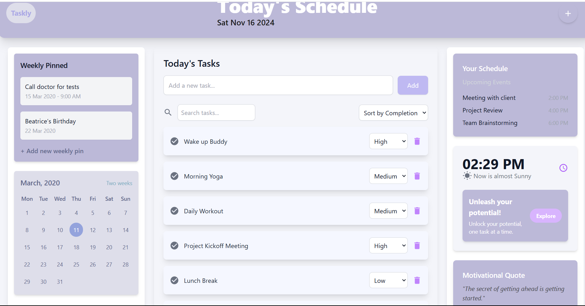
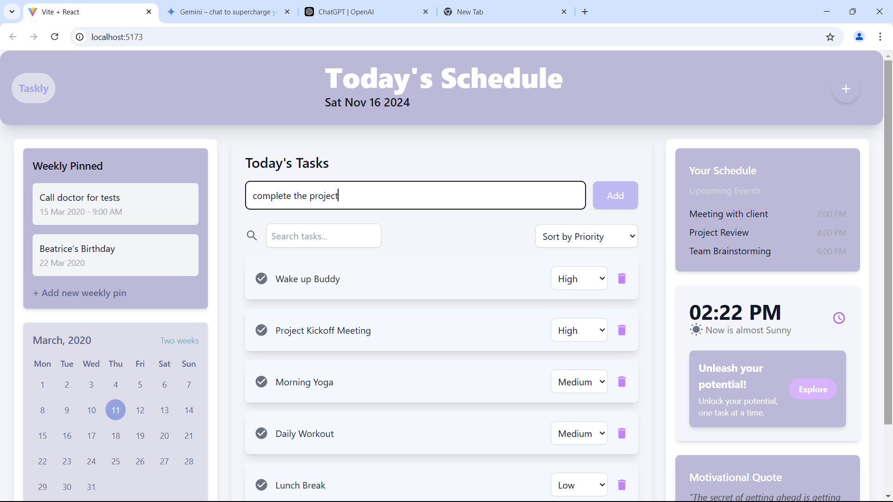
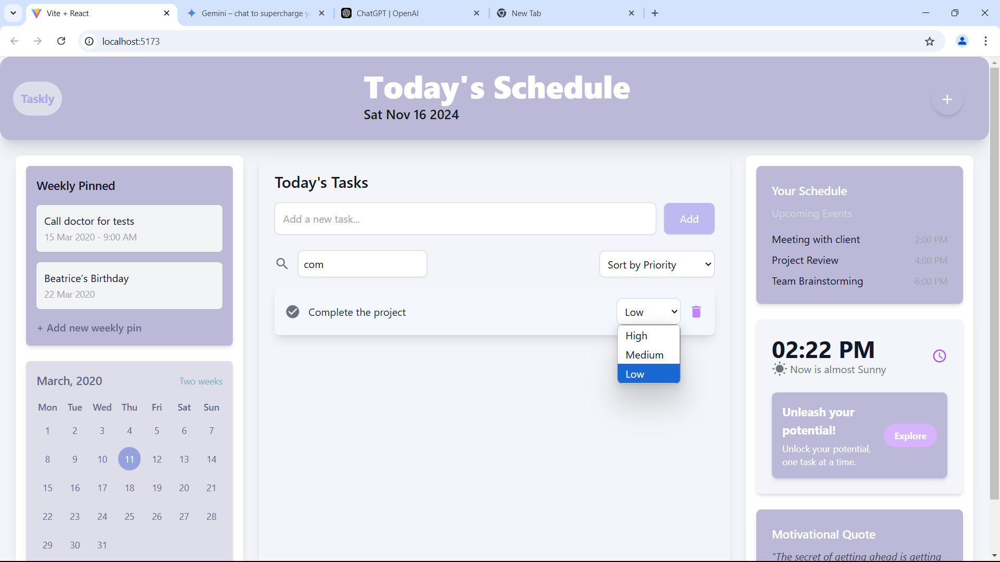

# FlarelinkTaskManager

A task management application built with React, designed to help users efficiently organize and prioritize their daily tasks. The app includes features such as task addition, deletion, prioritization, completion tracking, and search functionality.

1. Application and Functionality
   Features:
   Task Management:

Add new tasks using an intuitive input field.
Delete unwanted tasks with a single click.
Mark tasks as complete or pending.
Prioritization and Sorting:

Assign priorities to tasks (High, Medium, Low).
Sort tasks by priority or completion status for better task organization.
Search:

Search tasks in real-time by entering keywords in the search bar.
Additional Widgets:

Calendar view for scheduling and time management.
Display current date and time.
Motivational quotes to keep you inspired.
Responsive Design:

Optimized for all devices with a modern and clean UI using Tailwind CSS. 2. Setup and Launch Process
Prerequisites:
Node.js installed on your system.
npm or yarn for managing dependencies.
Setup Instructions:
Clone the repository:

bash
Copy code
git clone https://github.com/your-username/your-repo-name.git
cd your-repo-name
Install the project dependencies:

bash
Copy code
npm install
Start the development server:

bash
Copy code
npm start
Open the application in your browser:

The app will automatically open at http://localhost:3000. If not, manually open this URL. 3. Assumptions Made During Development
User Behavior:

Users will input valid and meaningful task names when adding tasks.
Tasks are generally categorized by priority and sorted to organize workflow effectively.
Dummy Data:

Preloaded dummy tasks are used for demonstration purposes.
Tasks have predefined IDs, titles, priorities, and completion statuses.
Environment:

This application is developed as a client-side app, and task data resets on page reload since no backend or persistent storage (e.g., localStorage or database) is integrated. 4. Screenshots of the Project
Task List:

A screenshot showing tasks and actions like adding, deleting, and sorting.

Search and Sidebar:

A screenshot of the search bar, calendar, and motivational widgets.
